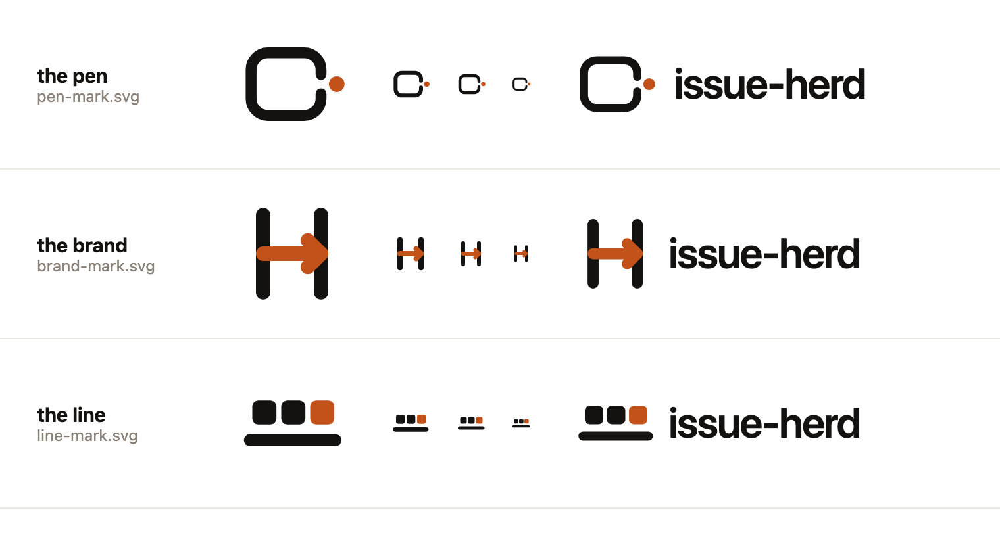
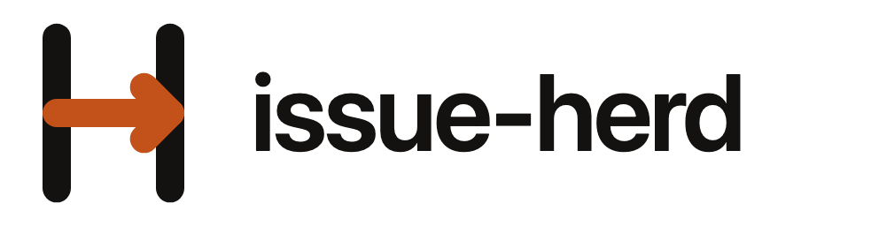
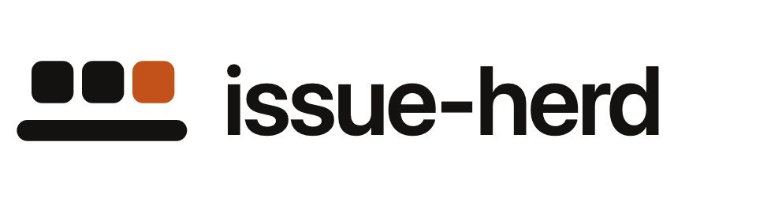
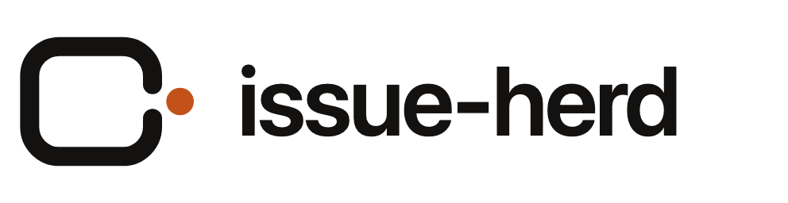

# issue-herd logo — three proposals

Three marks for the same idea: **a software factory that runs on your own machine.** Each one is a
single geometric shape, one accent colour, no gradients, no gears, no robot. Pick one (or tell me
which parts of which two to combine) and it goes into the main `README.md` and anywhere else the
project shows up.

Nothing here is wired into the project yet — this directory is the proposal.

## The three

### 1. The brand — `brand-mark.svg` (recommended)

An **`H` branded with an arrow.** Two posts and a bar; the bar is an arrow that runs left to right
and lands on the far post.

- It is the "herd" `H` and a factory mark at the same time — the stamp a line puts on every unit
  that passes QC, and the iron a rancher puts on every animal. Both meanings are the same picture,
  which is what makes it *this* project's mark and not a generic one.
- It says the thing the tool does in one stroke: work goes in one side and comes out the other.
- Strongest at 16px of the three — two verticals and a horizontal survive any favicon, any terminal
  tab, any avatar crop.
- Most room to grow: the arrow bar can shorten into an `H` monogram alone for tight spots, and the
  same construction stamps onto stickers and a CLI splash in one colour.

### 2. The line — `line-mark.svg`

**Three units on a rail**, the last one finished. The most literal reading of "software factory":
a line, work moving along it, one piece done.

- Maps exactly onto the tool's model — `maxConcurrent` agents, each in its own worktree, moving in
  parallel down one line, and the finished one hands you a PR.
- The warmest of the three; three shapes in a row reads as a small herd as well as a batch.
- Deliberately a *scene*, not a letter. That is its risk: it carries no `H`, so the wordmark has to
  do the naming, and at 16px the three units start to merge into a dashed bar.

### 3. The pen — `pen-mark.svg`

**An enclosure with a gate open on the right**, and one unit already through it.

- This is the worktree: an issue gets its own fenced-off pen, an agent works in it alone, and what
  leaves through the gate is a pull request. Of the three, it describes the *isolation* that makes
  the tool safe to run on your own repo.
- Softest and friendliest shape; the single dot gives it an obvious "done" state, which animates
  well (the dot travels out of the gate) if we ever want a loading indicator.
- Its risk: at a glance it can read as a lowercase `c`. The wide, low box and the narrow gate are
  tuned to fight that, but it is the least distinctive silhouette of the three.

## Why these and not the usual thing

The "software factory" phrase went mainstream in 2026 (Factory.ai's *Factory 2.0*, Warp Factories,
the agentic-software-factory consultancies), and the visual language of that whole space has
converged hard. What everyone is already doing:

- **Gears and cogs** — the default factory metaphor; visually noisy and completely unowned.
- **Robot heads and friendly droid faces** — the agent cliché.
- **A factory silhouette with smokestacks** — literal and grim; also says "we make pollution".
- **Conveyor + cardboard box** — logistics, not software.
- **Hex grids, circuit traces, isometric cubes, infinity loops** — generic "tech".
- **A purple-to-blue gradient blob** — the house style of roughly every dev tool shipped since 2021.
- **Angular modular geometry with an industrial-tech wordmark** — Factory.ai's territory
  specifically; the closest neighbour we have, and the one to stay furthest from.

All three proposals avoid every item on that list. They stay on the side of the metaphor nobody is
using: the **stockyard** — pens, gates, brands, units moving through in order. That side is ours by
name (`herd`, `herdr`), it is still a factory (throughput, isolation, a stamp on every unit), and it
gives us a warm, hand-drawn-feeling family instead of another cold blue cog.

Two more constraints shaped all three:

- **One shape, one accent.** Each mark is a single stroke path plus one ember-coloured element.
  Nothing here needs a gradient, and every mark works in pure black or pure white.
- **Legible at 16px.** They were drawn on a 96-unit grid with a 9–12 unit stroke and checked at
  128 / 32 / 24 / 16px before anything else. A logo for a CLI mostly lives in a terminal tab, a
  favicon and a GitHub avatar.

## Files

| File | What it is |
| --- | --- |
| `<name>-mark.svg` | the mark alone, 96×96 grid, for favicons and avatars |
| `<name>-lockup.svg` | mark + `issue-herd` wordmark, for the README header |
| `png/<name>-mark.png` | 512×512 transparent PNG |
| `png/<name>-lockup.png` | 992×256 transparent PNG |
| `png/contact-sheet-{light,dark}.png` | all three, at four sizes, on both backgrounds |

## Colour

| Token | Light | Dark |
| --- | --- | --- |
| ink | `#141210` | `#F6F2ED` |
| ember | `#C2521A` | `#C2521A` |

Ember is a hot-iron orange, not a tech blue — it is the one thing in the mark that is *doing*
something. The SVGs carry a `prefers-color-scheme` rule that swaps ink for the light tone on dark
backgrounds, with the light-mode colour left on the element as a presentation attribute so any
renderer that strips `<style>` still gets a correct, visible mark.

## Before the winner ships

- The wordmark in the lockups is set in live text (Inter, falling back to the system UI stack) so
  it renders differently depending on what the viewer has installed. Convert it to outlines once a
  direction is chosen.
- Add a `favicon.svg` / `apple-touch-icon.png` cut from the chosen mark if the project ever gets a
  page.
