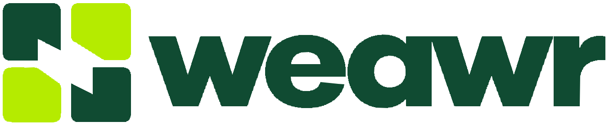

# The mark

<picture>
  <source media="(prefers-color-scheme: dark)" srcset="weawr-logo-reverse.svg">
  
</picture>

**weawr**, pronounced *weaver*, spelled exactly like that: lower case, always. The symbol is
**four rounded blocks with a diagonal opening cut through them**, the colours alternating forest
and lime around the square. The wordmark is heavy, lower case and set tight; it is drawn artwork,
not a typeface.

The design language, the app icon, the reference boards and the motion versions came in the
designer's handoff on [#69](https://github.com/jmwind/weawr/issues/69)
(`weawr-designer-handoff.zip`); this directory holds the parts the repository uses. The rename from
issue-herd was [#71](https://github.com/jmwind/weawr/issues/71).

## Files

| File | What it is |
| --- | --- |
| `weawr-mark.svg` | the symbol alone, forest and lime, for light grounds — anywhere square |
| `weawr-mark-reverse.svg` | the symbol for dark grounds: a lighter green stands in for forest, lime stays |
| `weawr-logo.svg` | symbol + wordmark, forest and lime, for light grounds — what the README shows |
| `weawr-logo-reverse.svg` | symbol + wordmark in chalk and lime, for dark grounds |
| `weawr-logo-monochrome.svg` | symbol + wordmark in one colour |
| `../icons/` | the favicon set: `favicon.svg`, `favicon.ico` (16–256), PNGs at 16/32/48, `apple-touch-icon.png` (180), `icon-192.png`, `icon-512.png`, `site.webmanifest` — the symbol on a dark rounded tile |
| `../brand/tokens.css` | the palette as CSS custom properties |

Every SVG is paths only, wordmark included, so nothing depends on a font being installed and any
of them can be inlined. The console inlines `weawr-mark-reverse.svg` into its title bar and serves
`../icons/` as its favicon; the rest of the console is not themed yet.

## Colour

| Token | Hex | Where |
| --- | --- | --- |
| forest | `#104B32` | two of the blocks, and the wordmark on light grounds |
| lime | `#B5EB00` | the other two blocks; the accent everywhere |
| ink | `#10251B` | the tile behind the favicon; text on light grounds |
| chalk | `#F5F7EF` | the wordmark on dark grounds; the light ground itself |
| icon green | `#72A98A` | forest's stand-in on dark grounds: the reverse mark, the favicon |

The site colours (`--weawr-site-background`, `--weawr-site-text`, `--weawr-muted`, `--weawr-rule`)
are in `tokens.css` for when the console gets its theme; nothing reads them yet.

## Rules

- Keep the four-block shape, the diagonal opening, the alternating colours and the lower-case name.
- Clear space of at least one block's width on every side.
- Small sizes get the symbol alone; below that, the favicon set (the symbol on a tile).
- Dark ground, reverse files; light ground, plain files. Never colour the blocks all the same.

## Still open

The vectors were traced from the approved raster concept; a designer may still refine curves,
optical spacing and small-size detail. The motion versions — a six-second assembly and a rotating
wheel, GIF and MP4 — use the raster and should be rebuilt from these paths before they go anywhere
public. They are in the handoff, not here.
